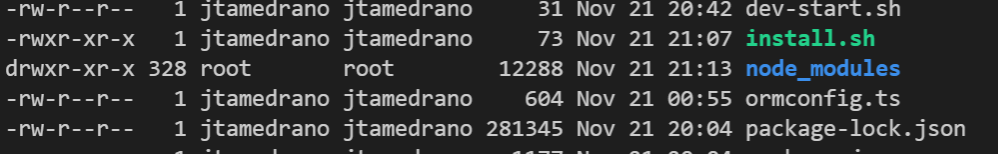

# Automodiv <!-- omit in toc -->

Master Git Repository for Automodiv including Backend, Frontend for Dealers and Shoppers, and DS

- [Install Instructions for Development](#install-instructions-for-development)
- [Restarting Dev Server](#restarting-dev-server)
- [Branch Naming Conventions](#branch-naming-conventions)

## Install Instructions for Development

The install instruction are as follow:

1. Clone Repo
2. Go to each directory and make sure install.sh has execute permissions
   - Example on how to see what permissions a file has:
     - ```sh
        cd ./server
        ls -al
       ```
       This should return something like this
       
       - if install.sh does not have the permissions -rwxr-xr-x run the following command: `chmod +x install.sh`.
       - Check this for wait.sh
3. First Time Building? Run `./run.sh` in the root of the directory.
4. Then select Option 2 to build the server. Consult an admin for a copy of the .env
5. If you have any issues, first `ctrl + c`, then run option 1 to destroy, rebuild, and start.
6. Then code
7. Still having issues submit the issue to @kyleswillard or @jtamedrano with screen shots or screen record of your issue.

## Restarting Dev Server

There is a sh script in the root of the project. By running the command `./run.sh` the server will give a menu to select what option is needed for your convenience. 

Options include the following:
- Option 1) Destroy, Rebuild, Start: This command is perfect if you made changes to either a dockerfile or a to an entity in the backend.
- Option 2) Rebuild and Start: Run this option if your build failed and you just want to make sure it was an accident or pulled from main (You never know if someone installed new modules)
- Option 3) Starts server without destroying or rebuilding (quickest start as it doesn't need to install all the dependancies all over again.
- Option 4) Abort

This does require that you have a .env file in the root. If you need a copy of what the env should look like, please contact @jtamedrano.

## Branch Naming Conventions

For now all branch naming conventions should follow this format:

**This is due to change in January, 2022**

{service}/{feature-description}

example: server/dealer-employees-registration
